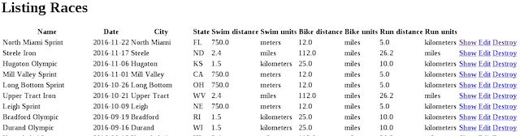
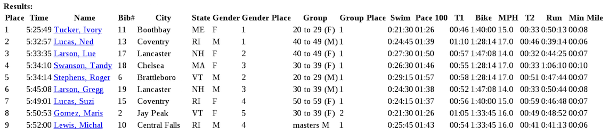

TriResults. Mongoid and Rails Scaffold

The overall requirments are:

  * Implement a model and custom type classes mapped to an existing 
  set of document schemas
  * Implement relationships of differing cardinality, realization, 
  and direction
  * Implement constraints and validations for the data tier
  * Implement queries
  * Implement Web access to the database tier using a MVC thru Rails
  scaffold

The functional goal of the assignment is to:

  * Implement a data tier for triathlon race results
  * Implement a web tier to register for races and view race results.






## Functional Requirements

1. Ingest a set of documents.

    * `db/races.json` - contains `Race` documents that represent a specific race
    to occur.
    * `db/racers.json` - contains `Racer` documents that represent a specific
    racer that participates in zero (0) or more races.
    * `db/results.json` - contains `Entrant` documents that represent a specific 
    racer's registration in a race and their results.

	
	[`Data Model`](docs/module3-summative-drawing.jpg)

2. Implement a data tier to process the existing data and manage new information.
The data tier consists of the following custom and document types:

    * Implement three (3) custom types that represent data without any specific
    identity.

        * `Point` - a geographic point for an address
        * `Address` - descriptive information for where something is located
        * `Placing` - a ranked order someone finishes in a race within a category

    * Implement nine (9) model classes plus a base class that represent
    specific information in a triathlon race.
    	
    	* `Racer` - represents a single individual and reference to all race entries.
    	* `RacerInfo` - represents the racer identity required by races he/she enters. The master copy 		is embedded within `Racer`. A copy of this is embedded within his/her `Entrant`, which 		represents the entry within a race.
    	* `Entrant` - represents a single racer's registration in a race and their results,
 		broken down by leg -- to include swim, bike, and run events in addition to 
 		the two transitions between the three events. 
		* `LegResult` - is a base class representing the event results within a race for a specific 		racer. A leg can represent a transition or actual sport events. Sub-classes are supplied to track 		unique information per event. All instances of this class and sub-types are contained within an 		embedded collection within `Entrant`. Instances of this class will also embed copies of the 		`Event` they are a result for.
		* `SwimResult` - is a sub-class of `LegResult` that reports results specific to a swimming event.
		* `BikeResult` - is a sub-class of `LegResult` that reports results specific to a bike event.
		* `RunResult` - is a sub-class of `LegResult` that reports results specific to a running event.
		* `Race` - represents the overall race with its events and entrant information.
		* `RaceRef` - represents race-identifying information that is copied into each `Entrant`. This is 		built from `Entrant` attributes.
		* `Event` - represents a specific event within a race. It has a name (e.g., "Swim", "Bike", or 		"Run") and a distance.
    	
		       
3. Implement an interface facade for the data tier to make access to 
information easier and safer for clients like the web tier. This
will include:

    * building a flat view of nested document attributes without
    changing our nested document structure
    * implementing cross-model service methods to avoid complex
    code from being written in the controller and view classes

4. Implement web page access to `Race` and `Racer` information and
the nested resource `Entrant` that holds the registration and results
associated with them.

    * `Racer`s
        - an index page of all `Racer`s
        - a show page of finishes in each `Race` (via `Entrant`)
    * `Race`s
        - an index page of all Race`s
        - a show page of results for each `Racer` (via `Entrant`)

5. Implement web page access to register for future races.

    * `Racer`s
        - an edit page where `Racer`s can register for upcoming
        `Race`s that have not yet registered for (i.e., create
        an `Entrant`)

ongoid within applications -- like rails console
    	    Mongoid.load!('./config/mongoid.yml')
    		...
    	   end
    	end
    	```

